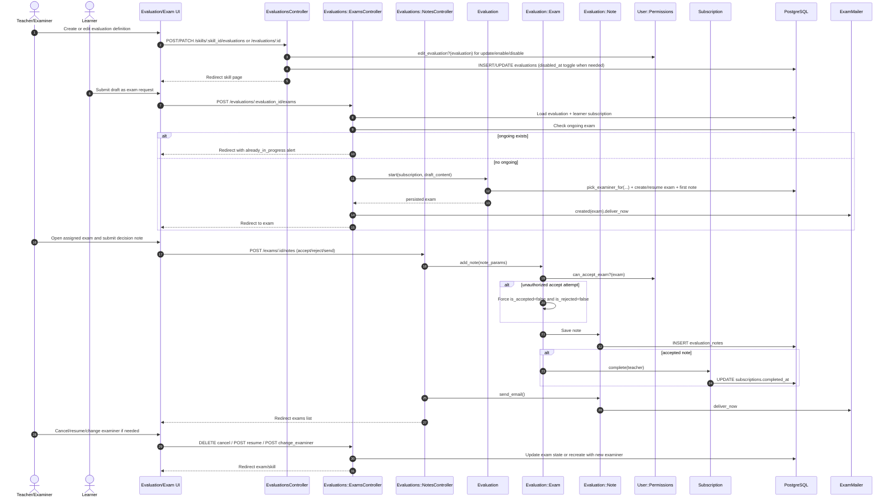

# Assessment Orchestration (Moderator/Teacher) - Detailed Flow

## Scope
This flow focuses on teacher/expert moderation of assessment: evaluation authoring, exam assignment/orchestration, note-based decisioning, and completion propagation.

## End-to-end implementation
1. UI entry points
- Evaluation controls in skill page (`app/views/skills/_evaluations.html.erb`, `app/views/evaluations/exams/_evaluation.html.erb`).
- Exam conversation and actions in `app/views/evaluations/exams/show.html.erb`.
- Teacher actions include activate/deactivate evaluation, reply/reject/accept note, and tracking ongoing exams.

2. Evaluation authoring and lifecycle
- `EvaluationsController#create` creates evaluation linked to skill and current user.
- `can_update_evaluation` uses `current_user.permissions.edit_evaluation?` for `edit/update/enable/disable`.
- `disable` sets `disabled_at`; `enable` clears it.

3. Exam orchestration
- Exam creation is initiated by learner, but assignment/orchestration logic is central for teacher flow:
  - `Evaluations::ExamsController#create` calls `Evaluation#start(subscription, content)`.
  - `Evaluation#start` transaction:
    - chooses examiner with `pick_examiner_for` (prefers less busy experts, same team, avoids previous examiner),
    - resumes canceled matching exam or creates a new `Evaluation::Exam`,
    - creates first `Evaluation::Note` from candidate content.
- Teacher sees assigned exams in `Evaluations::ExamsController#index` using scopes:
  - `in_community`, `of_user`, `order_by_last_note`.

4. Review and decision loop
- Teacher posts note via `Evaluations::NotesController#create`.
- `note_params` maps UI buttons into flags (`is_accepted`, `is_rejected`).
- `Evaluation::Exam#add_note`:
  - enforces acceptance permission (`can_accept_exam?`) by resetting accept/reject flags if unauthorized,
  - persists note,
  - if accepted, marks subscription complete (`subscription.complete(user)`) in transaction.
- On persisted note, controller calls `@note.send_email` for roundtrip notifications.

5. Operational controls
- `cancel` and `resume` for exam lifecycle.
- `change_examiner` cancels current exam and starts a new one with initial note content transferred.
- `show` denies access unless `current_user.permissions.read_exam?(@exam)`.

## Validations, checks, and rules
- `Evaluation`: must have `skill_id`, `user_id`, and `description`.
- `Evaluation::Exam`: examiner required.
- `Evaluation::Note`: content required unless accepted.
- Exam state guard: only one ongoing exam per candidate context (`subscription.exams.ongoing`).
- Authorization:
  - edit/destroy evaluation (`edit_evaluation?`, `destroy_evaluation?`),
  - read exam (`read_exam?`),
  - accept exam decision (`can_accept_exam?`).

## Side effects and storage
- Persistent storage: `evaluations`, `evaluation_exams`, `evaluation_notes`, `subscriptions`.
- Side effects:
  - `ExamMailer.created` on exam creation,
  - `Evaluation::Note#send_email` after note creation,
  - subscription completion updates learner status and may propagate to parent subscriptions.

## Sequence diagram

