# C4 Model Diagrams

The diagrams below describe the Sqily architecture at four C4 zoom levels, from ecosystem context down to code structure.

## 1) Context Diagram - Where does this system fit in the world?

Architectural question answered: **Who uses Sqily and why, and which external systems does it depend on?**

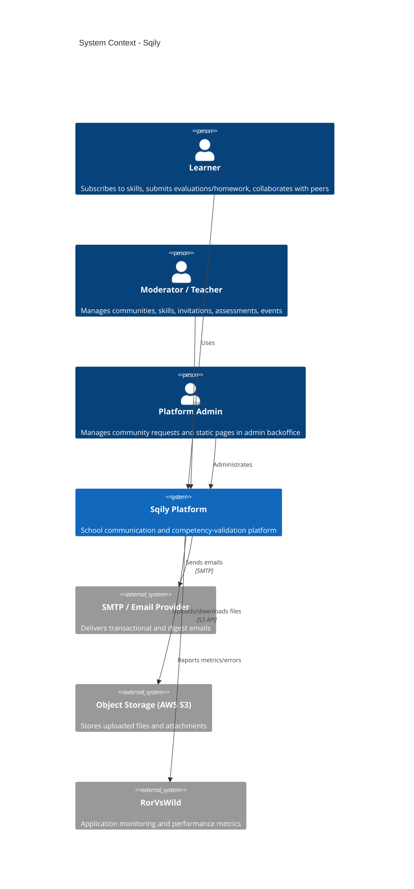

## 2) Container Diagram - What are the main building blocks?

Architectural question answered: **How is Sqily deployed and how do runtime containers communicate?**

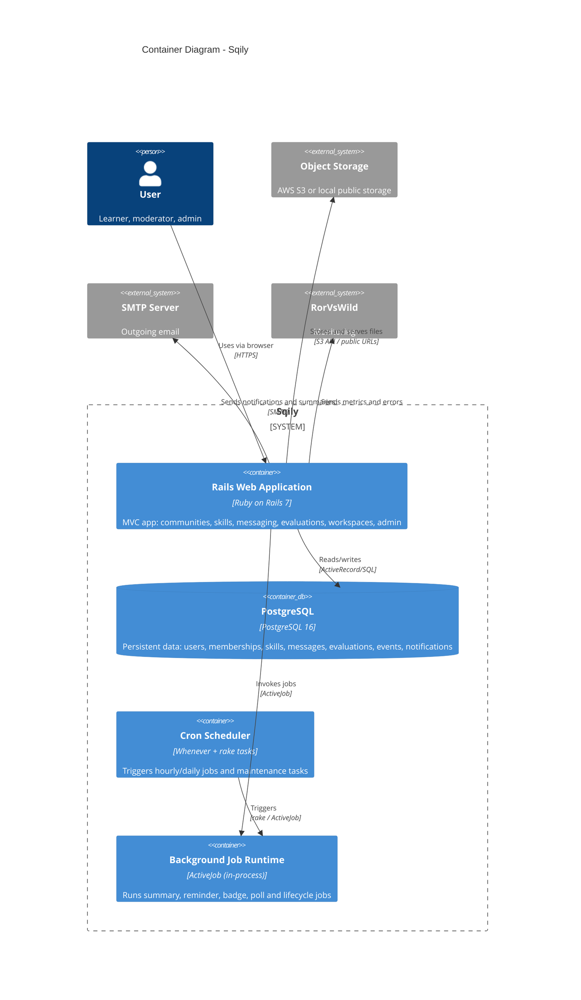

## 3) Component Diagram - What lives inside the backend container?

Architectural question answered: **What are the major internal responsibilities inside the Rails backend?**

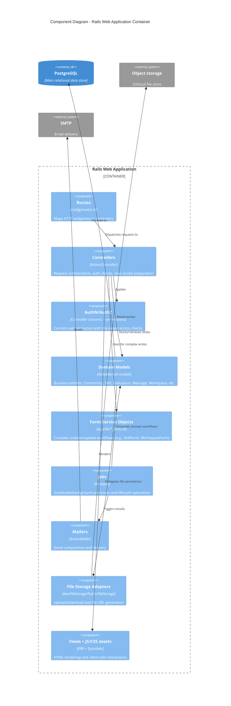

## 4) Code Diagrams - What's under the hood?

Architectural question answered: **How are the major backend components implemented at file/class level?**

### 4.1 Controllers Component (HTTP orchestration)

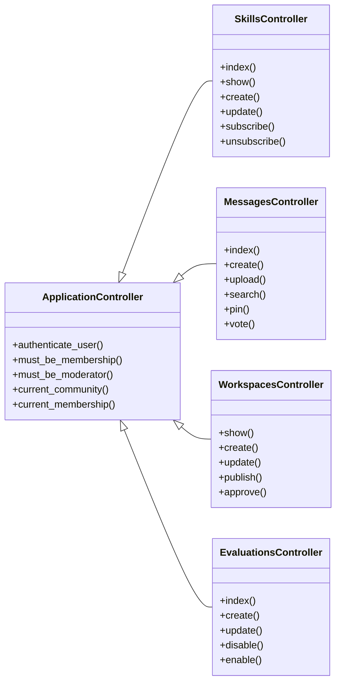

### 4.2 AuthN/AuthZ Component (access rules and identity context)

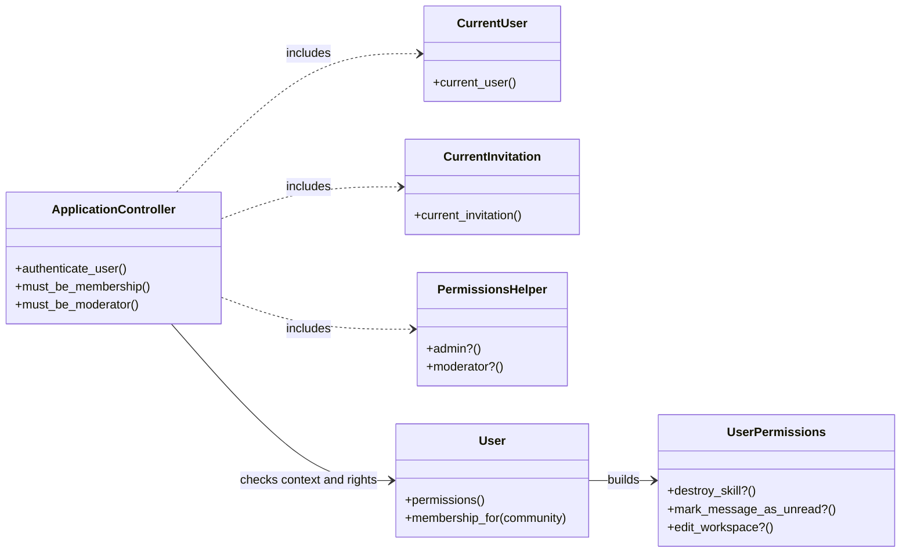

### 4.3 Domain Models Component (business entities)

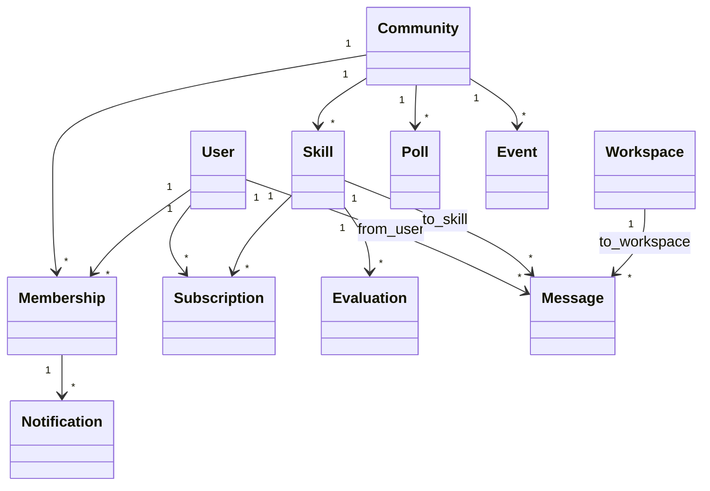

### 4.4 Form/Service Objects Component (complex write workflows)

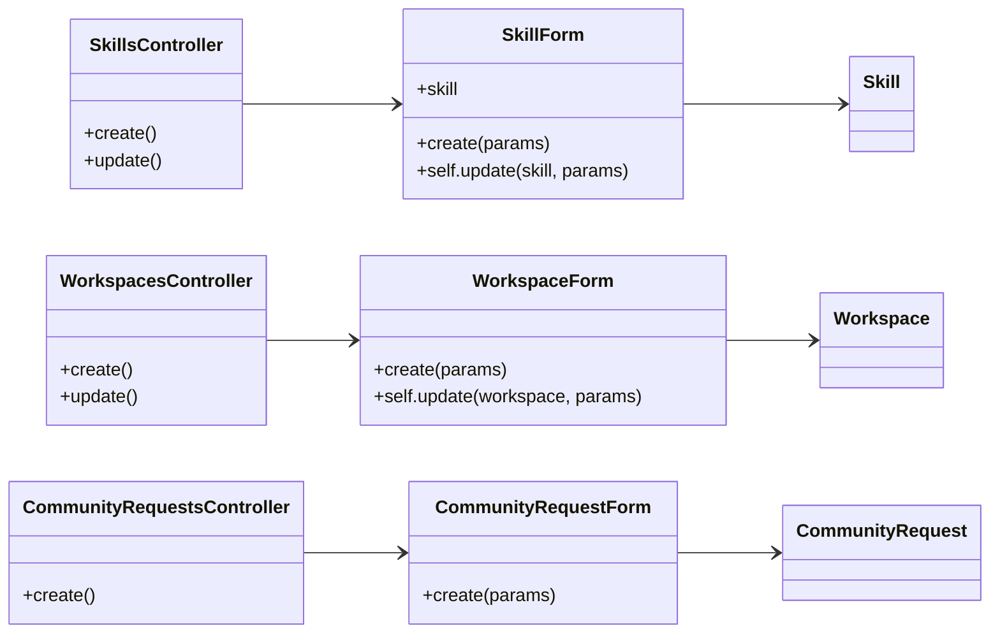

### 4.5 Jobs Component (scheduled/background execution)

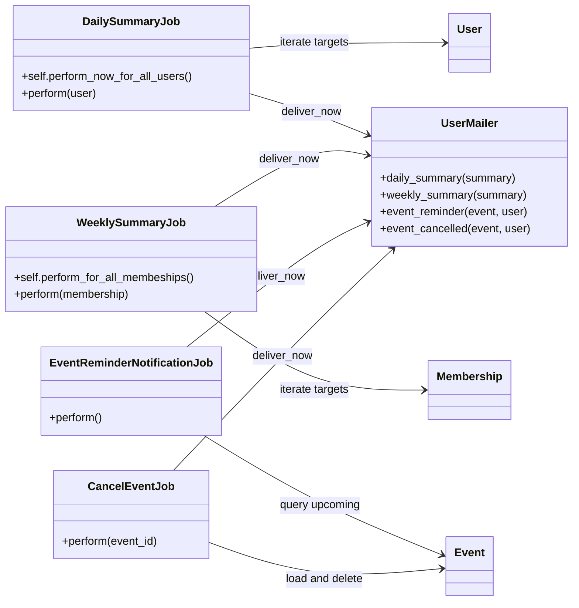

### 4.6 Mailers Component (email composition)

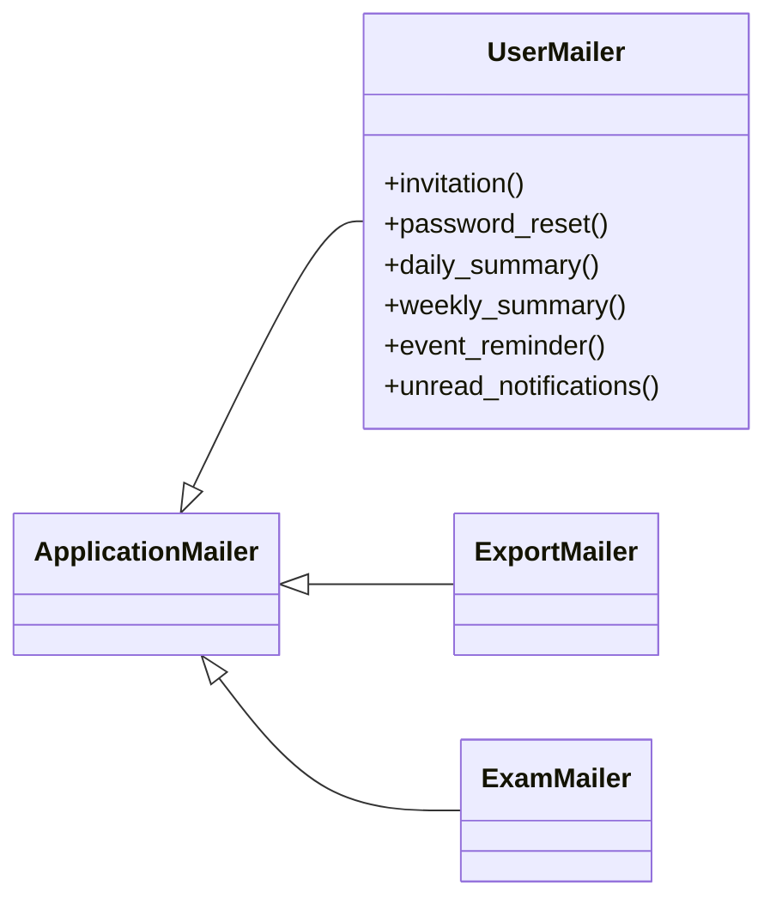

### 4.7 File Storage Adapters Component (binary/file persistence)

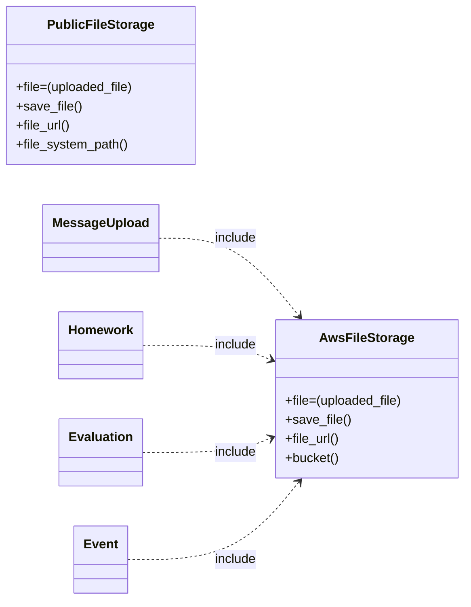

### 4.8 Views + Assets Component (presentation layer)

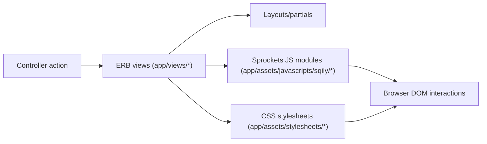

### Scope note
- Level 4 now includes one diagram per major component from the Level 3 backend view.
- Representative file references:
  - Controllers: `app/controllers/application_controller.rb`, `app/controllers/messages_controller.rb`, `app/controllers/skills_controller.rb`
  - AuthN/AuthZ: `app/controllers/concerns/current_user.rb`, `app/helpers/permissions_helper.rb`, `app/lib/user/permissions.rb`
  - Domain: `app/models/*.rb`
  - Forms/services: `app/lib/skill_form.rb`, `app/lib/workspace_form.rb`, `app/lib/community_request_form.rb`
  - Jobs: `app/jobs/*.rb`
  - Mailers: `app/mailers/*.rb`
  - File storage: `app/models/concerns/aws_file_storage.rb`, `app/models/concerns/public_file_storage.rb`
  - Views/assets: `app/views/**/*`, `app/assets/javascripts/**/*`, `app/assets/stylesheets/**/*`
