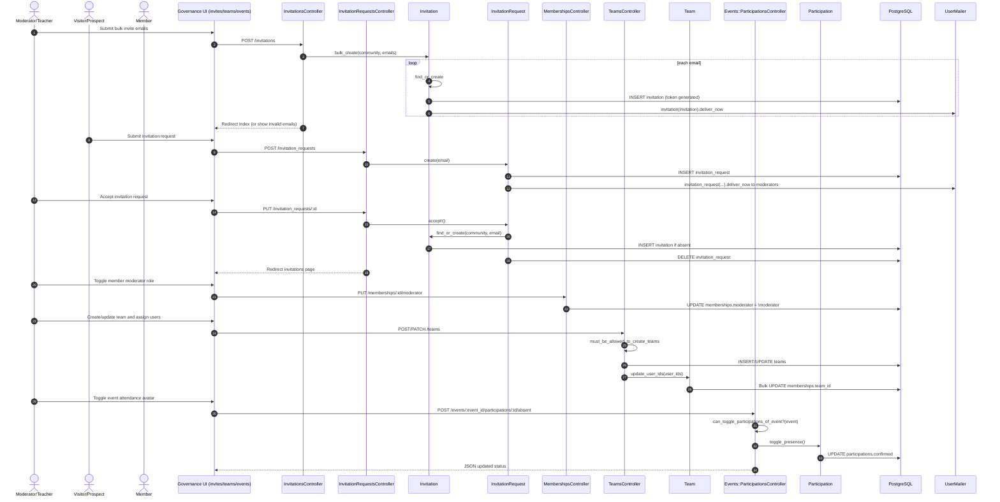

# Cohort and Participation Governance (Moderator/Teacher) - Detailed Flow

## Scope
This flow covers moderator governance of people and participation: invitations, invitation-request moderation, role/team management, and event participation oversight.

## End-to-end implementation
1. UI entry points
- Invitation management page: `app/views/invitations/index.html.erb`.
- Invitation request management on same area and public request form (`InvitationRequestsController#index/create`).
- Team create/edit screens: `app/views/teams/new.html.erb`, `edit.html.erb`.
- Event participation controls in `app/views/messages/_event_created.html.erb` (avatar toggles for attendance).

2. Invitation and join governance
- `InvitationsController#index/create/destroy` guarded by `must_be_moderator`.
- `create` accepts bulk emails (`split("\n")`) and calls `Invitation.bulk_create`.
- `Invitation.find_or_create` validates each email and uniqueness by community.
- `Invitation#after_create` sends invite email via `UserMailer.invitation`.
- Invitee flow via token (`InvitationsController#show`):
  - if logged in: `invitation.complete(current_user)` -> `community.add_user(user)` + destroy invitation,
  - else store `current_invitation` and redirect to registration.

3. Invitation request moderation
- Non-members can submit requests via `InvitationRequestsController#create`.
- `InvitationRequest.after_create` notifies all moderators (`UserMailer.invitation_request`).
- Moderator accepts with `InvitationRequest#accept!`:
  - creates invitation (`Invitation.find_or_create`) then deletes request.
- Moderator may also destroy request.

4. Membership role and team governance
- Moderator role toggling: `MembershipsController#moderator` -> `membership.toggle!(:moderator)`.
- Team management in `TeamsController` guarded by `current_membership.permissions.create_teams?`.
- On team create/update:
  - persist `Team`,
  - call `Team#update_user_ids(user_ids)` to bulk move/remove memberships using `update_all`.

5. Participation governance for events
- Event registration/unregistration through `EventsController#register/#unregister` and `Event#register/#unregister`.
- Moderator/owner attendance marking:
  - JS `Sqily.Event.Participation` calls `Events::ParticipationsController#toggle`.
  - Permission gate: `current_user.permissions.can_toggle_participations_of_event?(event)`.
  - `Participation#toggle_presence` cycles presence state.

## Validations, checks, and rules
- Invitation email format validation and uniqueness per community.
- Invitation request uniqueness by community/email.
- Team creation requires moderator-level membership permission.
- Event participation toggle permission requires event owner and event already started (`can_toggle_participations_of_event?`).
- Invite acceptance token must resolve inside current community context.

## Side effects and storage
- Persistent storage: `invitations`, `invitation_requests`, `memberships`, `teams`, `participations`, `waiting_participations`.
- Side effects:
  - invitation emails (`UserMailer.invitation`),
  - moderator notifications for invitation requests,
  - waiting-list promotion emails (`UserMailer.waiting_participation_finished`),
  - bulk membership team reassignment through SQL updates.

## Sequence diagram

