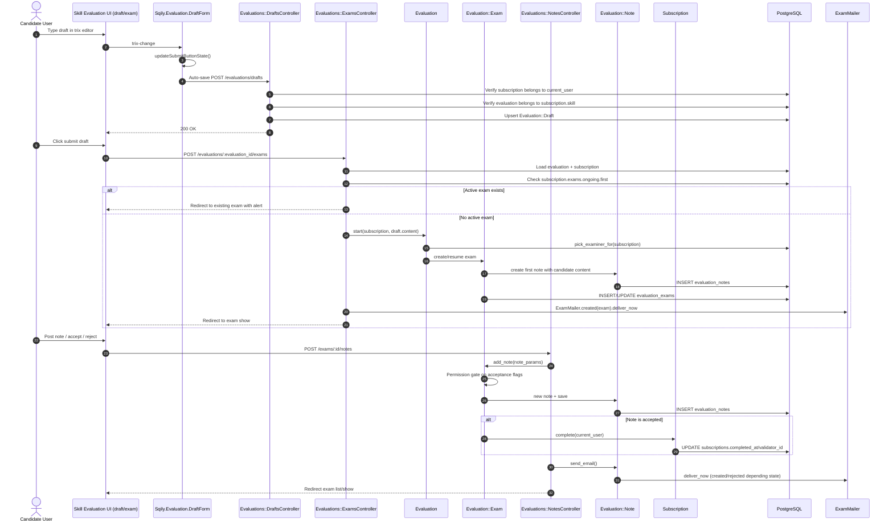

# Evaluation and Validation - Detailed Flow

## Scope
This flow covers evaluation lifecycle on a skill: draft auto-save, exam creation, discussion notes, accept/reject decision, and subscription completion.

## End-to-end implementation
1. UI entry points
- Skill page renders evaluation zone in `app/views/skills/_evaluations.html.erb`.
- Draft editor form is in `app/views/evaluations/drafts/_form.html.erb` with `data-ariato="Sqily.Evaluation.DraftForm"`.
- Exam conversation page is `app/views/evaluations/exams/show.html.erb`.

2. Draft auto-save and submission
- Frontend module `app/assets/javascripts/sqily/evaluation/draft_form.js` watches trix changes.
- It enables submit only when draft content is non-empty and activates `FormAutoSave`.
- Auto-save POSTs to `Evaluations::DraftsController#create` with `subscription_id`, `evaluation_id`, `content`.
- Controller checks ownership and skill consistency:
  - subscription must belong to current user,
  - evaluation must belong to that subscription skill.
- Then it upserts `Evaluation::Draft` (`find_or_initialize_by(...).update(...)`).

3. Exam creation
- Submit button posts to `Evaluations::ExamsController#create`.
- Controller resolves evaluation + current user subscription.
- Checks ongoing exam guard:
  - if any ongoing exam exists -> redirect to active exam with alert.
- Else calls `Evaluation#start(subscription, draft_content)`:
  - transaction,
  - selects examiner via `pick_examiner_for` (load balancing + team preference + no immediate repeat),
  - resumes existing canceled exam or creates new `Evaluation::Exam`,
  - creates first `Evaluation::Note` from candidate draft content.
- On success: `ExamMailer.created(exam).deliver_now` and redirect to exam page.

4. Exam conversation and decision
- `Evaluations::ExamsController#show` loads exam + notes and enforces `current_user.permissions.read_exam?`.
- User posts note via `Evaluations::NotesController#create` -> `Evaluation::Exam#add_note`.
- `add_note` business logic:
  - if user lacks permission to accept exam, force `is_accepted=false` and `is_rejected=false`,
  - save note,
  - if accepted note, call `subscription.complete(user)` in transaction.
- If note persisted, controller redirects and triggers `note.send_email`.

5. Lifecycle operations
- Candidate can cancel/resume exam (`ExamsController#cancel/#resume`) with sibling-active checks.
- Candidate can change examiner (`#change_examiner`) by canceling and re-starting with prior note content.
- Evaluation owners can enable/disable evaluation (`EvaluationsController#enable/#disable`) and edit metadata.

## Validations, checks, and rules
- `Evaluation` requires `skill_id`, `user_id`, `description`.
- `Evaluation::Exam` requires `examiner`.
- `Evaluation::Note` requires `content` unless accepting.
- Draft submittability rule: `Evaluation::Draft#submittable?` requires `evaluation.skill.experts.any?`.
- Access controls:
  - membership required (`must_be_membership`),
  - permission checks for editing evaluations and reading exams.

## Side effects and storage
- Persistent storage: `evaluations`, `evaluation_drafts`, `evaluation_exams`, `evaluation_notes`, `subscriptions`.
- Accepting an exam can mark subscription complete and propagate completion hierarchy.
- Email side effects:
  - `ExamMailer.created` on exam start,
  - `Evaluation::Note#send_email` for reply/rejection notifications.

## Sequence diagram

