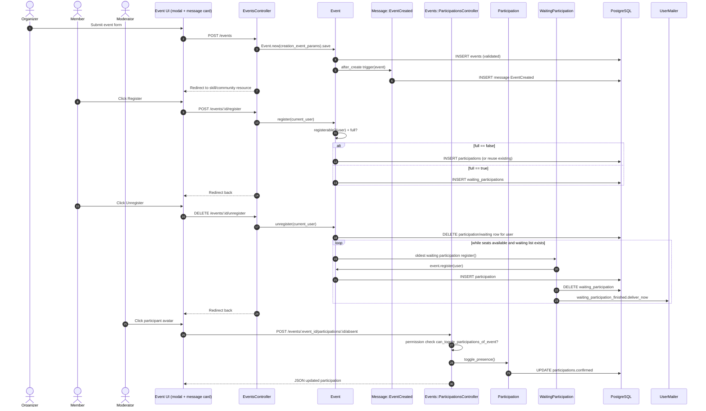

# Events Participation - Detailed Flow

## Scope
This flow covers event creation visibility in discussion, participant registration/unregistration, waiting-list promotion, and attendance toggling.

## End-to-end implementation
1. UI entry points
- Event can be created from message area modal (`app/views/events/_modal.html.erb` + `_form.html.erb`).
- Event messages are displayed with participation controls in `app/views/messages/_event_created.html.erb`.
- Event list view uses `app/views/events/index.html.erb` (all vs registered filter).
- Attendance toggling in participant avatars uses JS `app/assets/javascripts/sqily/event/participation.js`.

2. Event creation and publication in message stream
- POST `EventsController#create` with validated form data.
- `creation_event_params` maps event either to `skill` or `community`, always with creator user.
- `Event` validations enforce:
  - title/scheduled_at/registration_finished_at presence,
  - `max_participations > 0`,
  - scheduled date must be after registration deadline,
  - either `community` or `skill` must exist.
- After create, `Message::EventCreated.trigger(event)` runs via `Event.after_create`, creating a timeline message.

3. Registration path
- Register button posts to `EventsController#register` -> `Event#register(current_user)`.
- `Event#registerable?(user)` checks:
  - registration deadline not passed,
  - if skill event: user subscribed to skill,
  - if community event: user has community membership.
- If full: create `WaitingParticipation`; else create `Participation` (idempotent lookup first).

4. Unregistration and waiting list promotion
- Unregister button calls `EventsController#unregister` -> `Event#unregister(user)`.
- Removes participation and waiting entry for user.
- Calls `register_next_waiting_participations` loop:
  - while seats available, take oldest waiting entry and call `WaitingParticipation#register`.
  - when promoted, waiting row destroyed and `UserMailer.waiting_participation_finished` sent.

5. Attendance tracking path
- Moderator/authorized user clicks participant avatar.
- JS `Sqily.Event.Participation.toggleParticipation` POSTs to `Events::ParticipationsController#toggle`.
- Permission check: `current_user.permissions.can_toggle_participations_of_event?(event)`.
- `Participation#toggle_presence` cycles `confirmed` through `nil -> true -> false -> nil`.
- JSON response updates avatar class (`present`/`absent`) in UI.

## Validations, checks, and rules
- Edit rights: `Event#editable_by?(user)` must match event creator for update/delete.
- Register/unregister operations are guarded by registerability and capacity checks.
- Waiting list uses FIFO order (`waiting_participations.order(:created_at).first`).

## Side effects and storage
- Persistent storage: `events`, `participations`, `waiting_participations`, `messages` (`Message::EventCreated`).
- Optional event attachment uses `AwsFileStorage` through `Event` model.
- Email side effect on waiting-list promotion (`UserMailer.waiting_participation_finished`).
- Event cancellation path uses `CancelEventJob` to notify participants and delete event.

## Sequence diagram

