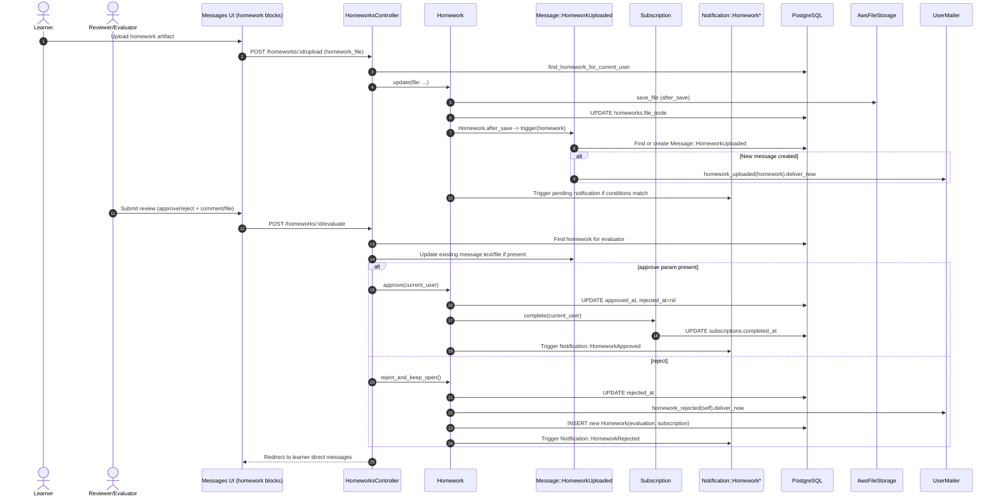

# Homework Submission and Review - Detailed Flow

## Scope
This flow covers homework artifact upload by the learner and review/decision by the evaluator, including messaging and notifications side effects.

## End-to-end implementation
1. UI entry points
- Reviewer workflow appears in `app/views/messages/_homework_uploaded.html.erb`.
- The partial shows state-dependent blocks (pending/approved/rejected) and an evaluation form posting to `evaluate_homework_path`.
- Learner sees status and artifact download links in the same message stream partial.

2. Homework upload path (learner)
- Endpoint: `HomeworksController#upload`.
- Guard: `find_homework_for_current_user` (`current_user.homeworks.find(params[:id])`) enforces ownership.
- Controller updates file via `@homework.update(file: params[:homework_file])`.
- `Homework` includes `AwsFileStorage`; after-save persists file blob and URL metadata.

3. Automatic side effects after homework save
- `Message::HomeworkUploaded` has `Homework.after_save { Message::HomeworkUploaded.trigger(self) }`:
  - if `file_node` exists, create (or reuse) message from learner to evaluator.
  - `after_create` sends `UserMailer.homework_uploaded`.
- Notifications from homework state transitions:
  - `Notification::HomeworkPending.trigger` when pending + file present,
  - `Notification::HomeworkApproved.trigger` when approved,
  - `Notification::HomeworkRejected.trigger` when rejected.

4. Reviewer decision path
- Reviewer submits evaluation form in message partial to `HomeworksController#evaluate`.
- Controller loads homework (expert path), optionally updates existing `Message::HomeworkUploaded` with comment/file.
- Decision branch:
  - approve: `Homework#approve(current_user)` -> sets `approved_at` and calls `subscription.complete(by_user)`.
  - reject: `Homework#reject_and_keep_open` -> marks rejected, sends rejection mail, creates a new open homework slot.
- Redirects to direct conversation with learner.

5. Cleanup path
- Learner may delete their own homework via `HomeworksController#destroy` (owner-guarded).

## Validations, checks, and rules
- Ownership check for upload/destroy is strict (`current_user.homeworks.find`).
- Decision endpoint separated (`find_homework_for_expert`) and intended for expert/evaluator usage.
- `Homework.pending?` means neither approved nor rejected.
- Approve and reject are mutually exclusive state writes (`approved_at`/`rejected_at`).

## Side effects and storage
- Persistent storage: `homeworks`, `messages` (`Message::HomeworkUploaded`), `notifications`.
- Binary storage: `AwsFileStorage` writes file to S3/local bucket path.
- Emails:
  - `UserMailer.homework_uploaded` on submission,
  - `UserMailer.homework_rejected` on rejection.
- Approval side effect can complete subscription and cascade progression logic.

## Sequence diagram

