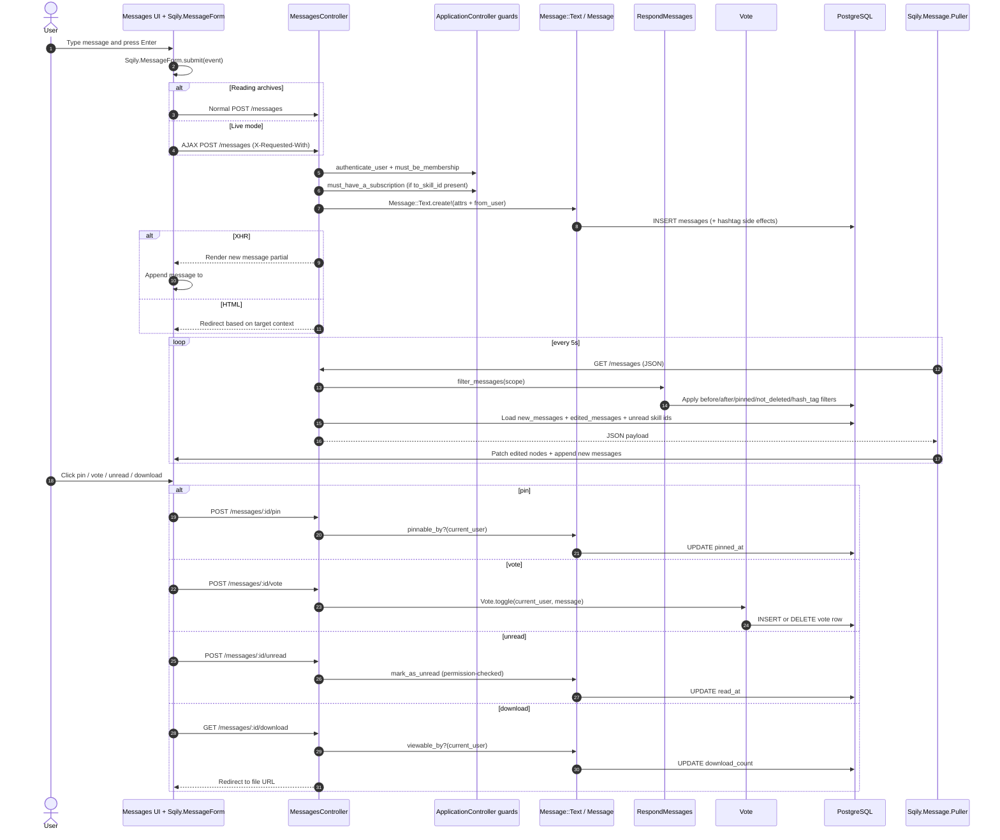

# Messaging and Collaboration - Detailed Flow

## Scope
This flow covers posting/reading messages (community, skill, workspace, direct), live refresh, and key collaboration actions (pin, vote, unread, file download, search).

## End-to-end implementation
1. UI entry points
- `app/views/messages/index.html.erb` renders timeline container and message form.
- `app/views/messages/_form.html.erb` posts text messages and provides modals for file upload/poll/event.
- `app/assets/javascripts/sqily/message_form.js` intercepts submit and sends AJAX for non-archive view.
- `app/assets/javascripts/sqily/message/puller.js` polls every 5s for new/edited messages.

2. Message creation path
- UI submit -> `MessagesController#create`.
- `before_action`: `authenticate_user`, `must_be_membership`, `must_have_a_subscription` (only if skill-targeted).
- Controller creates `Message::Text.create!(message_attributes.merge(from_user: current_user))`.
- On XHR request, returns partial HTML; client appends to timeline (`afterSend`).
- On non-XHR request, redirects based on target (`to_user`/`to_skill`/`to_workspace`/community).

3. Message read and refresh path
- Initial list via `MessagesController#index` and `filter_messages` from `RespondMessages` concern.
- Scope selected by context:
  - direct: `.between(current_user, user)` and mark incoming unread as read,
  - skill: `.to_skill(skill)` and touch subscription `last_read_at`,
  - workspace: `.to_workspace(workspace)`,
  - community: `.to_community(current_community)` and touch membership `last_read_at`.
- Poller hits same endpoint with JSON accept header; response updates:
  - edited messages,
  - unread skill activity markers,
  - newly arrived messages.

4. Collaboration actions
- `pin`: `MessagesController#pin` -> `Message#pinnable_by?` -> `toggle_pinned_at`.
- `vote`: `MessagesController#vote` -> `Vote.toggle(current_user, message)`.
- `unread`: `MessagesController#unread` gated by `current_user.permissions.mark_message_as_unread?`.
- `update`: only author scope (`Message.from_user(current_user).find(params[:id])`).
- `destroy`: author or moderator.
- `download`: `Message#viewable_by?(current_user)` + increments `download_count`.

5. Search path
- `MessagesController#search` runs separate queries for `Message::Text` and `Message::Upload` using `Message.search` and full-text/file matching (`text_search`).

## Validations, checks, and rules
- `Message` validations:
  - recipient must exist (`to_user` or `to_community` or `to_skill` or `to_workspace`),
  - sender required,
  - sender cannot target self in direct message.
- Skill messaging requires active subscription (`must_have_a_subscription`).
- Non-moderators only see `not_deleted` scope in filtered results.
- Hash tags are extracted on text save (`watch_hash_tags_on :text`).

## Side effects and storage
- Persistent storage: `messages`, `votes`, `messages_users`, `hash_tags`.
- File messages (`Message::Upload`) use `AwsFileStorage` concern and save blobs to S3/local URL.
- Reading in skill/community updates read timestamps (`subscriptions.last_read_at` / `memberships.last_read_at`).
- Download action increments `messages.download_count`.

## Sequence diagram

