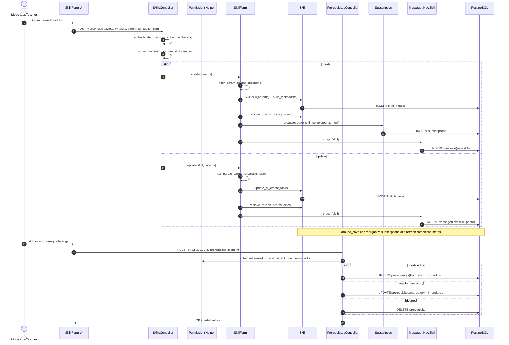

# Skill Architecture Management (Moderator) - Detailed Flow

## Scope
This flow covers moderator/teacher actions for building and maintaining the skill structure: creating skills, attaching tasks, setting parent-child hierarchy, managing prerequisites, and publishing visibility.

## End-to-end implementation
1. UI entry points
- Skill list and tree entry point: `app/views/skills/index.html.erb`.
- Add/edit buttons shown when `moderator?` or `current_community.free_skill_creation`.
- Parent-context creation links from `app/views/skills/_parent.html.erb` and `_child.html.erb` (`new_skill_path(..., skill: { parent_id: ... })`).

2. Controller gates and request handling
- `SkillsController` guards write actions with:
  - `before_action :authenticate_user`
  - `before_action :must_be_membership`
  - `before_action :must_be_moderator_or_free_skill_creation` on `create/edit/update`.
- `create` delegates to `SkillForm#create`.
- `update` delegates to `SkillForm.update`.

3. Create/update orchestration via `SkillForm`
- `SkillForm#create(params)`:
  - `filter_param_parent_id` accepts `parent_id` only when parent is a root skill and `parent.can_have_children?`.
  - Builds child tasks (`build_tasks`) from submitted `tasks` payload.
  - Saves `Skill`.
  - On success:
    - `skill.remove_foreign_prerequisites` (sanitizes invalid cross-scope edges),
    - creates creator subscription as completed: `Subscription.create!(user: creator, skill:, completed_at: Time.now)`,
    - emits `Message::NewSkill.trigger(skill)`.
- `SkillForm.update(skill, params)`:
  - same hierarchy filtering,
  - updates/creates tasks (`update_or_create_tasks`),
  - saves skill and re-sanitizes prerequisites,
  - emits `Message::NewSkill.trigger(skill)`.

4. Hierarchy and prerequisite management
- Parent-child hierarchy stored by `skills.parent_id`.
- Prerequisite endpoints (`PrerequisitesController`):
  - `create`: `@skill.prerequisites.create!(from_skill_id: ...)`
  - `toggle_mandatory`: flips `mandatory`
  - `destroy`: removes edge
- Authorization for prerequisite edits uses `must_be_authorized_to_edit_current_community_skills` from `PermissionsHelper`.

5. Structural propagation rules after changes
- `Skill#refresh_subscription_validations_around_save` runs around save:
  - detects parent/mandatory changes,
  - reorganizes subscriptions on impacted parent/old parent,
  - refreshes completion status (`Subscription#refresh_completed_at`) for impacted skills.
- `Skill#remove_foreign_prerequisites` removes prerequisite links that no longer fit the allowed subtree/root scope.

## Validations, checks, and rules
- `Skill` validations: presence (`name`, `description`, `community_id`), uniqueness of name per community.
- Prevent self-parenting: `cannot_not_be_parent_of_itself`.
- Hierarchy rule: only root skills without evaluations can have children (`Skill#can_have_children?`).
- Authorization rule for skill write operations:
  - moderator/admin, or
  - creator when community allows free skill creation.

## Side effects and storage
- Persistent storage: `skills`, `tasks`, `subscriptions`, `prerequisites`.
- Side effects:
  - auto-subscribe creator as completed expert for newly created skill,
  - broadcast-like new skill message via `Message::NewSkill`,
  - subscription graph reorganization after hierarchy/mandatory changes.

## Sequence diagram

