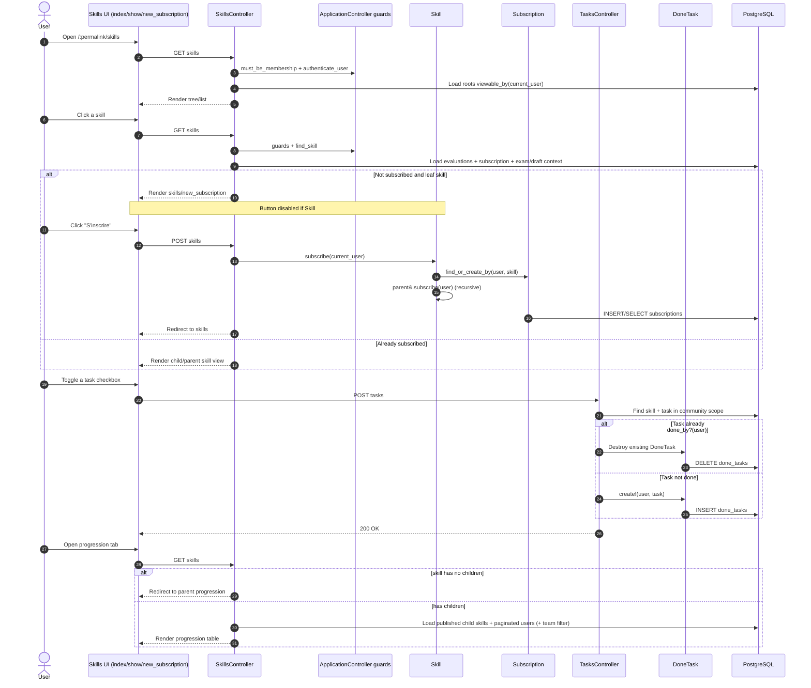

# Skill Discovery and Progression - Detailed Flow

## Scope
This flow covers the user journey from browsing the skill catalog/tree to subscribing, completing tasks, and viewing progression.

## End-to-end implementation
1. UI entry points
- `app/views/skills/index.html.erb` renders the skills page and community/personal tree toggle.
- `app/views/skills/_tree.html.erb` injects tree JSON (`skill_to_tree_json`) for client-side rendering.
- `app/views/skills/_item.html.erb` renders each skill card, state badges, unread markers, and pin action.
- Opening a skill goes to `SkillsController#show`.

2. Controller orchestration
- `SkillsController` runs `before_action :must_be_membership`, `:authenticate_user`, and `:find_skill` (except `index/new/create`).
- `show` loads evaluations with `@skill.evaluations.listable_by(current_user).one_version_per_user.order(id: :desc)`.
- If user has a subscription, controller loads ongoing exam and lazily builds a draft (`@subscription.build_draft`) when needed.

3. Subscription lifecycle
- If not subscribed and skill is leaf, UI renders `app/views/skills/new_subscription.html.erb`.
- Subscribe action posts to `SkillsController#subscribe` -> `Skill#subscribe(current_user)`.
- `Skill#subscribe` does `Subscription.find_or_create_by(user:, skill:)` and recursively subscribes parent skills (`parent&.subscribe(user)`).
- Unsubscribe uses `SkillsController#unsubscribe` -> `Skill#unsubscribe(user)` with cascade cleanup:
  - destroy subscription homeworks/exams/draft,
  - destroy subscription,
  - possibly uncomplete/unsubscribe parent when no dependent child remains.

4. Task progression updates
- Task toggle calls `TasksController#toggle`.
- If done, removes `DoneTask`; else creates `DoneTask.create!(user:, task:)`.
- This updates per-user task completion display in skill pages.

5. Progression view
- `SkillsController#progression` redirects to parent if current skill has no children.
- Otherwise loads published child skills and paginated users (`current_community.users.order(:name).page(params[:page])`), optionally filtered by `team_id`.
- `app/views/skills/progression.html.erb` and `_progression_table.html.erb` render aggregated progression matrix.

## Validations, checks, and rules
- Access control: `must_be_membership`, `authenticate_user`.
- Skill creation/editing guard: `must_be_moderator_or_free_skill_creation`.
- Model validations: `Skill` requires `name`, `description`, `community_id`; unique name per community.
- Parent integrity: `Skill#cannot_not_be_parent_of_itself`.
- Startability rule: `Skill#startable_by?(user)` enforces minimum and mandatory prerequisites recursively.
- Subscription completion propagation: `Subscription#complete`, `#uncomplete`, `#refresh_completed_at` synchronize parent/child completion states.

## Side effects and storage
- Persistent storage: `skills`, `subscriptions`, `tasks`, `done_tasks`, `prerequisites` tables.
- Recursive parent subscription changes can update multiple rows in one user action.
- Skill save hook `Skill#refresh_subscription_validations_around_save` can reorganize subscriptions and refresh completion states.

## Sequence diagram

