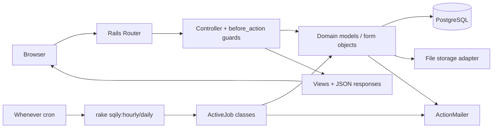

# Runtime Architecture

## Runtime Building Blocks

### 1) Web application container
- Technology: Ruby on Rails 7, Puma.
- Process entrypoints:
  - `web: bundle exec puma -C config/puma.rb` (Procfile)
  - release migration task: `bundle exec rake db:migrate`.
- Responsibilities:
  - HTTP request handling, rendering, form processing
  - Domain orchestration via models/forms/controllers
  - Email dispatch via ActionMailer
  - Triggering/sync execution of ActiveJob tasks

### 2) PostgreSQL database
- Main transactional store for all business entities.
- Schema source of truth: `db/schema.rb`.

### 3) Scheduler and background execution
- Scheduling via `whenever` (`config/schedule.rb`):
  - hourly: `rake sqily:hourly`
  - daily at 08:00: `rake sqily:daily`
- Job logic runs in app runtime (`ActiveJob::Base`, queue `:default`).
- No separate external queue adapter configured by default in production config.

### 4) File storage
- Two storage mechanisms coexist:
  - custom S3/public object storage through `AwsFileStorage` concern and `AWS_BUCKET_URL`
  - local disk storage paths via `PublicFileStorage` and `config/storage.yml`
- File-bearing domains include messages uploads, events attachments, evaluations, homeworks, avatars.

### 5) Email delivery
- ActionMailer configured with SMTP when `SMTP_URL` is present.
- Core mail flows: invitations, homework/evaluation notifications, summaries, reminders.

### 6) Monitoring/telemetry
- `RorVsWild` instrumentation in scheduled tasks and error wrapping in jobs.

## Deployment Topology

### Local development (docker-compose)
- Services:
  - `web` container: app code + bundle cache, exposed on `3000`
  - `db` container: PostgreSQL 16
- Core environment variables in compose:
  - `DATABASE_URL`
  - `RAILS_MASTER_KEY`
  - `BINDING`

### Production assumptions
- SSL enforced (`config.force_ssl = true`).
- Asset compilation disabled at runtime (`config.assets.compile = false`), precompile expected in deploy pipeline.
- Syslog logger configured.
- Deployment rake sequence (`sqily:after_deploy`):
  - `db:migrate`
  - `assets:precompile`
  - `sqily:update_crontab`
  - `tolk:sync`

## Request and Processing Path

## Security and Access Control Runtime Notes
- Request-level protection:
  - CSRF protection enabled in `ApplicationController`.
  - User resolution from signed cookie session token.
  - Community membership and moderator gates enforced in controllers.
- Admin namespace protected by explicit `current_user_must_be_admin` guard.

## Configuration Surface (operational)

### Required/important environment variables
- `DATABASE_URL`
- `RAILS_MASTER_KEY`
- `RAILS_LOG_LEVEL` (optional override)
- `SMTP_URL` (for outbound email)
- `AWS_BUCKET_URL` and optional `AWS_BUCKET_PREFIX` (for custom object storage)

### Operationally relevant configs
- `config/schedule.rb` (cron cadence)
- `lib/tasks/sqily.rake` (scheduled workload)
- `config/environments/production.rb` (runtime behavior)
- `config/storage.yml` (ActiveStorage fallback/local setup)

## Known Architectural Characteristics
- Monolithic Rails architecture with rich domain model.
- Heavy model callbacks and domain side effects (messages/notifications/emails) influence transaction boundaries.
- Polling-based near-real-time UX for messaging (`Sqily.Message.Puller`), not WebSocket-based.
