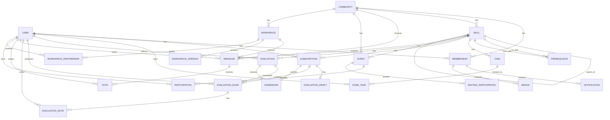

# Canonical Domain Model

This document is the high-level source of truth for core entities and their relationships, derived from `db/schema.rb` and model behavior.

## Domain Areas
- Identity and governance: `User`, `Community`, `Membership`, `Team`, `Invitation`, `InvitationRequest`
- Learning structure: `Skill`, `Prerequisite`, `Task`, `DoneTask`, `Subscription`
- Assessment: `Evaluation`, `Evaluation::Draft`, `Evaluation::Exam`, `Evaluation::Note`, `Homework`
- Collaboration: `Message`, `Vote`, `HashTag`, `Poll`, `PollChoice`, `PollAnswer`, `Event`, `Participation`, `WaitingParticipation`
- Portfolio: `Workspace`, `Workspace::Version`, `Workspace::Partnership`, `Workspace::Lock`
- Signals and analytics: `Notification`, `Badge`, `PageView`, `Page`

## ERD (core entities)

## Invariants and Structural Constraints
- `Membership` uniqueness: one `(user_id, community_id)`.
- `InvitationRequest` uniqueness: one `(community_id, email)` pending request.
- `Participation` uniqueness: one `(event_id, user_id)`.
- `DoneTask` uniqueness: one `(user_id, task_id)`.
- `Prerequisite` uniqueness: one `(from_skill_id, to_skill_id)`.
- `Skill`:
  - must have `name`, `description`, `community_id`,
  - name unique per community,
  - cannot be its own parent.
- `Event`:
  - must have title/scheduling fields,
  - `max_participations > 0`,
  - registration must close before scheduled date,
  - must belong to either a `community` or a `skill` context.
- `Evaluation::Exam` must have an examiner.

## Lifecycle States (core entities)

### Subscription
- Pending: `completed_at = null`
- Completed: `completed_at != null` (optional `validator_id`)
- Can be uncompleted; parent/child completion may cascade.

### Evaluation
- Active: `disabled_at = null`
- Disabled: `disabled_at != null`
- Deletable only when no exams exist.

### Evaluation::Exam
- Ongoing: `is_canceled = false` and no accepted note
- Completed: at least one note with `is_accepted = true`
- Canceled: `is_canceled = true`
- Can resume only if no active sibling exam for same subscription.

### Homework
- Open draft slot: `file_node = null`
- Pending review: `file_node != null` and `approved_at = null` and `rejected_at = null`
- Approved: `approved_at != null`
- Rejected: `rejected_at != null` (may spawn a new open homework slot)

### Skill
- Draft/internal: `published_at = null`
- Published: `published_at != null`
- Hierarchy role:
  - Root: `parent_id = null`
  - Child: `parent_id != null`

### Workspace
- Approval:
  - Not approved: `approved_at = null`
  - Approved: `approved_at != null`
- Publication:
  - Unpublished: `published_at = null`
  - Published: `published_at != null`
- Versioning: append-only conceptual history through `workspace_versions`.

## Notes on Derived/Computed Relationships
- Expertise is derived from `subscriptions.completed_at` on a skill.
- Community-level messaging includes direct community posts and skill-scoped posts in that community.
- Several role capabilities are dynamic and computed from membership flags plus object ownership.
