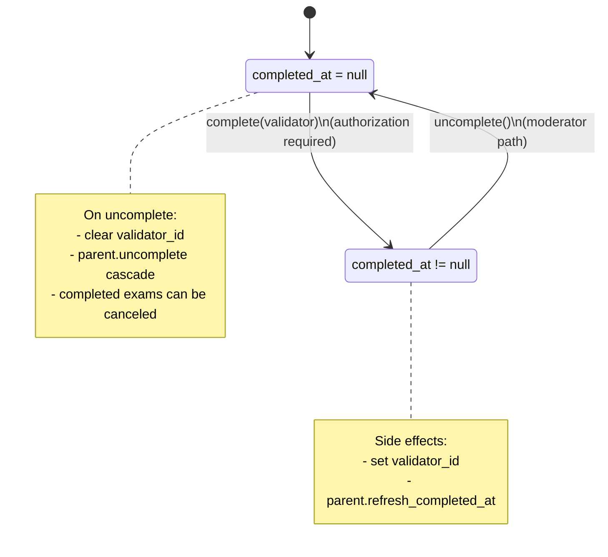
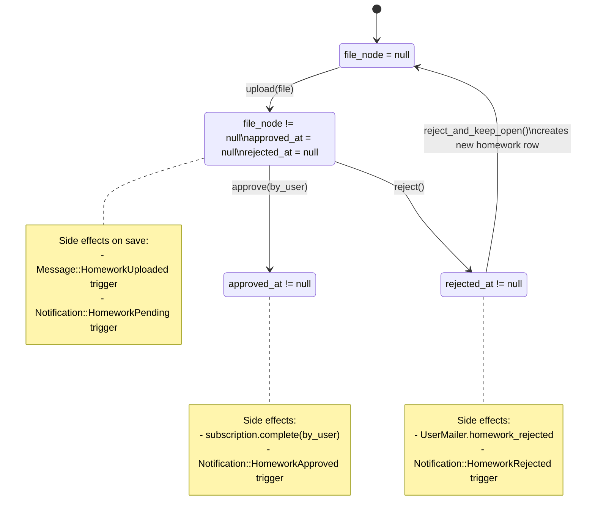
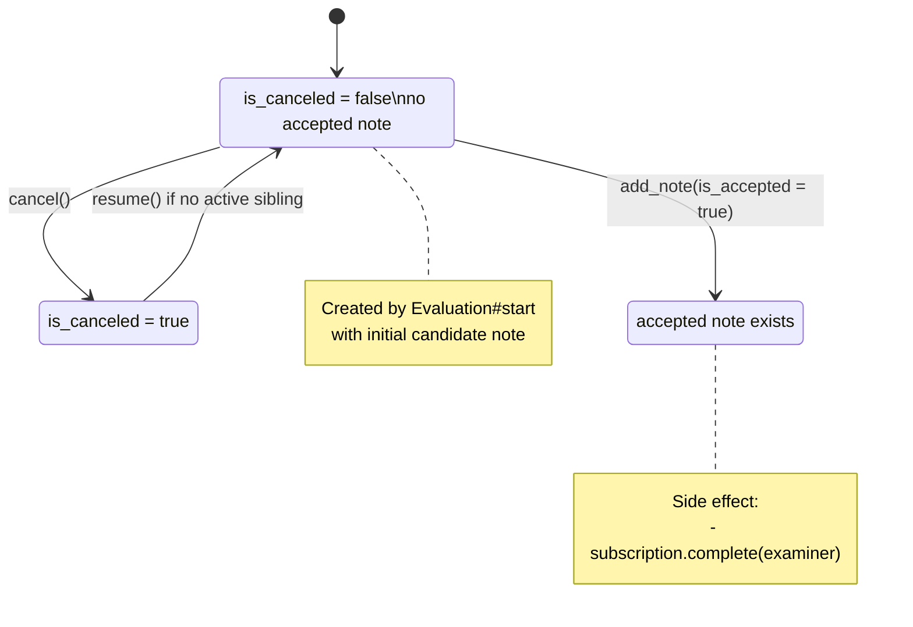
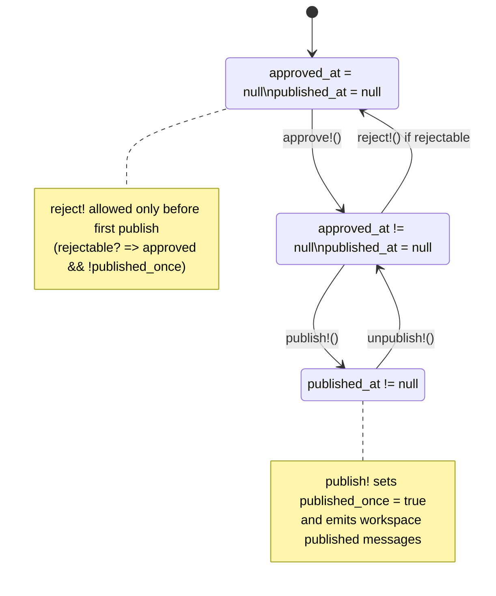
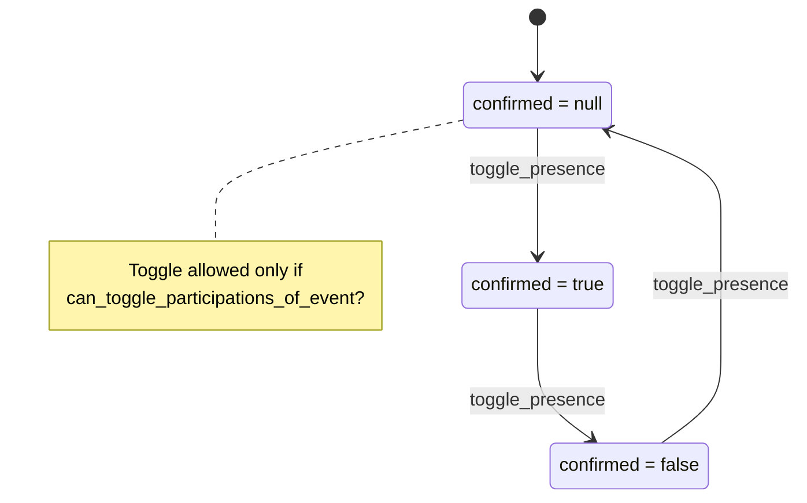

# State Machines

Explicit lifecycle transitions for core workflow entities.

## 1) Subscription

State fields:
- `completed_at`
- `validator_id`

Transition triggers:
- `SubscriptionsController#complete` -> `Subscription#complete`
- `SubscriptionsController#uncomplete` -> `Subscription#uncomplete`
- `Evaluation::Exam#add_note` (accepted note) -> `subscription.complete`
- `Homework#approve` -> `subscription.complete`

## 2) Homework

State fields:
- `file_node`
- `approved_at`
- `rejected_at`

Transition triggers:
- `HomeworksController#upload`
- `HomeworksController#evaluate`
- `Homework#approve`, `Homework#reject`, `Homework#reject_and_keep_open`

## 3) Evaluation::Exam

State fields:
- `is_canceled`
- accepted note existence (`evaluation_notes.is_accepted = true`)

Transition triggers:
- `Evaluations::ExamsController#create/cancel/resume/change_examiner`
- `Evaluations::NotesController#create` -> `Evaluation::Exam#add_note`

## 4) Workspace

State fields:
- `approved_at`
- `published_at`
- `published_once`

Transition triggers:
- `WorkspacesController#approve/#reject/#publish/#unpublish`
- Permission checks in `User::Permissions`

## 5) Participation

State field:
- `confirmed` (`nil`, `true`, `false`)

Transition triggers:
- `Events::ParticipationsController#toggle` -> `Participation#toggle_presence`

## Notes
- These are persistence-backed state machines derived from current model/controller behavior.
- Some transitions are guarded by role/ownership checks and by parent object state.
